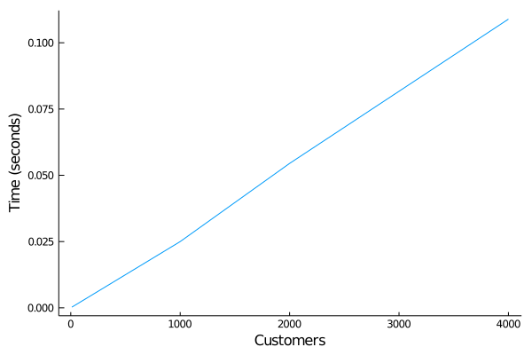
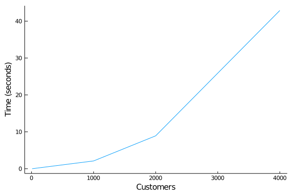
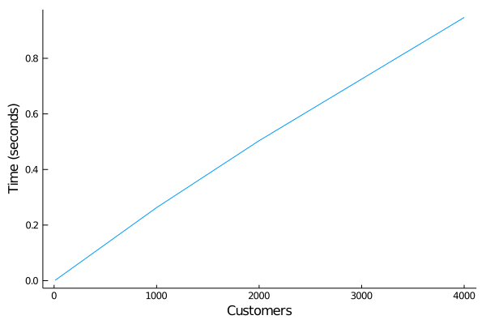
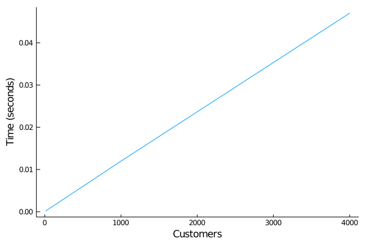

# M/M/c queue benchmarks

The original problem is found [over at SimJulia](https://github.com/BenLauwens/SimJulia.jl/blob/master/examples/queue_mmc.ipynb). It models an M/M/c queue with c=2 servers and 10 customers.

[@dfish](https://github.com/itsdfish) proposed in [issue #1](https://github.com/pbayer/DiscreteEventsCompanion.jl/issues/1) to compare [SimJulia](https://github.com/BenLauwens/SimJulia.jl)'s performance on the problem with that of `DiscreteEvents`. He was interested also in how the solution scaled in both packages. The first comparison came out very poorly for DiscreteEvents:

**`SimJulia` example** (`bench_queue_mmc_SimJulia.jl`)


**similar code in `DiscreteEvents`** (`bench_queue_mmc_chn.jl`)


Experience with other simulations in `DiscreteEvents` tells that even the cases with several 1000 customers should run in well under a second. Is there something conceptually wrong with the model?

## Finding and fixing the problem

The original example and the adoption to DiscreteEvents allocate the customer queue before starting the simulation. Instead it is easy to model an arrival process which generates new Customers right when they arrive. In this case the customer queue doesn't get too long and the Julia scheduler doesn't have to handle thousands of asynchronous tasks (processes).

The **modified model** (`bench_queue_mmc_chn2.jl`) runs much faster:


If you run the script repeatedly on your machine, you will notice each time different outcomes. The generated tasks have to compete against everything else running on thread 1. If we move the model to another processor core, it can run at full speed.

The **modified model on thread 2** (`bench_queue_mmc_chn3.jl`):


This beats the original example.

## Modeling the servers


## An activity based solution

----
benchmarks were done on:

```julia
julia> versioninfo()
Julia Version 1.4.2
Commit 44fa15b150* (2020-05-23 18:35 UTC)
Platform Info:
  OS: macOS (x86_64-apple-darwin18.7.0)
  CPU: Intel(R) Core(TM) i9-9880H CPU @ 2.30GHz
  WORD_SIZE: 64
  LIBM: libopenlibm
  LLVM: libLLVM-8.0.1 (ORCJIT, skylake)
Environment:
  JULIA_NUM_THREADS = 8
  JULIA_EDITOR = atom  -a
```
