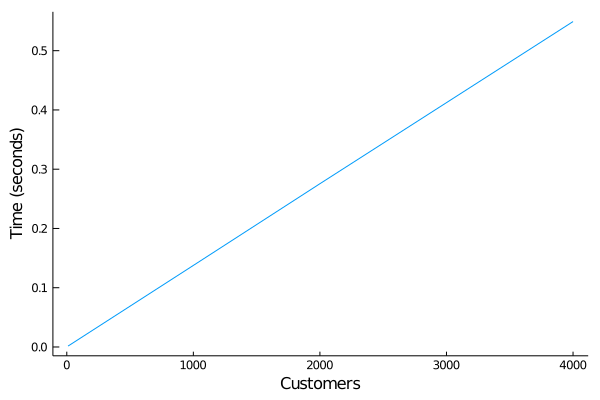
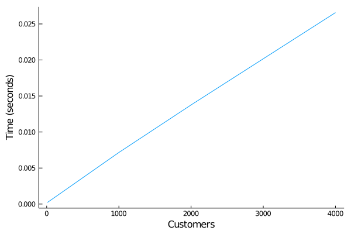

# M/M/c queue benchmarks

The original example is found [over at SimJulia](https://github.com/BenLauwens/SimJulia.jl/blob/master/examples/queue_mmc.ipynb) about an [M/M/c queue](https://en.wikipedia.org/wiki/M/M/c_queue) with c=2 servers and 10 customers. It models the 10 customers as processes lining up in a queue and requesting the service of two servers.

[@dfish](https://github.com/itsdfish) proposed in [issue #1](https://github.com/pbayer/DiscreteEventsCompanion.jl/issues/1) to compare [SimJulia](https://github.com/BenLauwens/SimJulia.jl)'s performance on the problem with that of `DiscreteEvents`. He was interested also in how the solution scaled in both packages. The first comparison came out very poorly for DiscreteEvents:

**`SimJulia` example** (`bench_queue_mmc_SimJulia.jl`)


**similar code in `DiscreteEvents`** (`bench_queue_mmc_chn.jl`)


Experience with other simulations in `DiscreteEvents` tells that even the cases with several 1000 customers should run in a fraction of a second. Is there something conceptually wrong with the model?

## Finding and fixing the problem

The original example and the adoption to `DiscreteEvents` allocate the customer queue before starting the simulation. It is easy instead to model an arrival process  generating new Customers right when they arrive. Then the customer queue doesn't get too long and the Julia scheduler doesn't have to handle thousands of asynchronous tasks.

The **modified model** (`bench_queue_mmc_chn2.jl`) runs much faster:


If you run the script repeatedly on your machine, you will notice each time different outcomes. The generated tasks have to compete against everything else running on thread 1. If we move the model to another processor core, it can run at full speed.

The **modified model on thread 2** (`bench_queue_mmc_chn3.jl`):


This then beats the original example. But still our model has a large overhead since  every customer is an asynchronous task running only once (and all have to be started and removed).

## Modeling the servers

It is better to model the arrivals and the two servers as only three processes/tasks with the customers being tokens for them to work on. This gives us the same functionality without the need to continuously starting and removing new tasks.

The **server model** (`bench_queue_mmc_srv.jl`)



This is again faster than the last one (we are in the milliseconds now) and it scales much better since we have to do the expensive task setup only for three tasks (regardless of the number of customers). Can we speed up this further by running it on a separate processor core?

The **server model on thread 2** (`bench_queue_mmc_srv1.jl`)



Now it takes about 127 μs with no discernible pattern of scaling (statistical fluctuations).

## An activity based solution

There are yet other ways to model the M/M/c problem. Here we have done an activity based solution only based on events.

- yet to do

## Conclusion

Clearly models matter for speed.

----
benchmarks were done on:

```julia
julia> versioninfo()
Julia Version 1.4.2
Commit 44fa15b150* (2020-05-23 18:35 UTC)
Platform Info:
  OS: macOS (x86_64-apple-darwin18.7.0)
  CPU: Intel(R) Core(TM) i9-9880H CPU @ 2.30GHz
  WORD_SIZE: 64
  LIBM: libopenlibm
  LLVM: libLLVM-8.0.1 (ORCJIT, skylake)
Environment:
  JULIA_NUM_THREADS = 8
  JULIA_EDITOR = atom  -a
```
