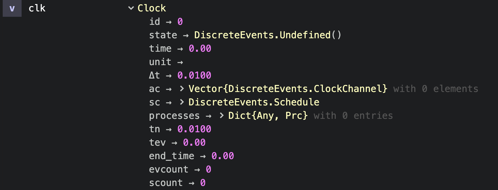
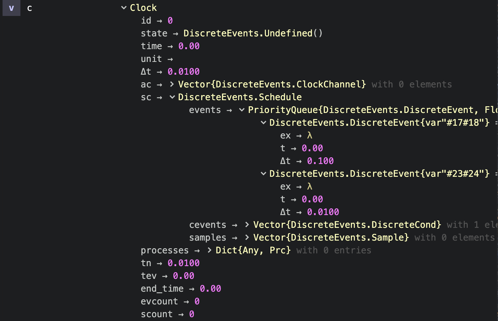

# Diagnosis

## Clocks

As usual in Julia you can access clock parameters by `clock.parameter`:

```julia
julia> clk                  # normally pretty printing is enabled
Clock 0, thread 1 (+ 0 ac): state=DiscreteEvents.Undefined(), t=0.0 , Δt=0.01 , prc:0
  scheduled ev:0, cev:0, sampl:0


julia> clk.                 # with clk. + tab + tab you get the parameters
ac        end_time   evcount    id         processes  sc         scount     state      tev        time       tn         unit       Δt
julia> clk.time             # then you can select one of them
0.0
```

You can switch off pretty printing and then get the Julia `Base.show_default` display:

```julia
julia> DiscreteEvents.prettyClock(false)

julia> clk
Clock(0, DiscreteEvents.Undefined(), 0.0, , 0.01, DiscreteEvents.ClockChannel[], DiscreteEvents.Schedule(DataStructures.PriorityQueue{DiscreteEvents.DiscreteEvent,Float64,Base.Order.ForwardOrdering}(), DiscreteEvents.DiscreteCond[], DiscreteEvents.Sample[]), Dict{Any,Prc}(), 0.01, 0.0, 0.0, 0, 0)
```

In [Juno](http://docs.junolab.org/)'s workspace then you can access a `Clock` variable's structure and dig deeper into it:



## Events

The following clock shows that two timed events `ev:2` and one conditional events `cev:1` have been scheduled:

```julia
julia> c
Clock 0, thread 1 (+ 0 ac): state=DiscreteEvents.Undefined(), t=0.0 , Δt=0.01 , prc:0
  scheduled ev:2, cev:1, sampl:0
```

Registered events can be found in the scheduling structure `c.sc` of the clock. Better is to switch off pretty printing with `DiscreteEvents.prettyClock(false)` and to dive into them in the Atom workspace:




## Processes

Three processes have been registered to the following clock:

```julia
julia> clock.processes
Dict{Any,Prc} with 3 entries:
  0 => Prc(0, Task (runnable) @0x000000010fc82ad0, Clock 0, thrd 1 (+ 0 ac): state=DiscreteEvents.Undefined(), t=0.0 , Δt=0.01 , prc:3…
  2 => Prc(2, Task (runnable) @0x000000010d13db10, Clock 0, thrd 1 (+ 0 ac): state=DiscreteEvents.Undefined(), t=0.0 , Δt=0.01 , prc:3…
  1 => Prc(1, Task (runnable) @0x000000013a183190, Clock 0, thrd 1 (+ 0 ac): state=DiscreteEvents.Undefined(), t=0.0 , Δt=0.01 , prc:3…
```

We can check process 0 with

```julia
julia> clock.processes[0].task
Task (runnable) @0x000000010fc82ad0
```

If the task had failed, we would get the stacktrace with that command.
