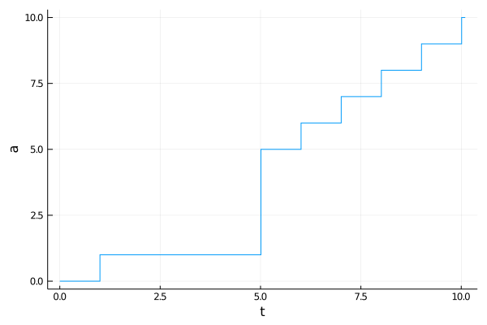
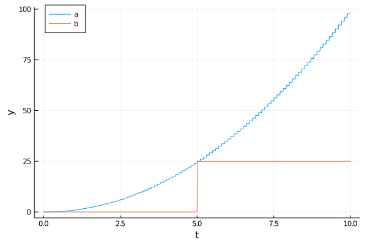

# Event Scheduling

In order to represent an event ``\,(e_i,t_i): e_i \in \mathcal{E}\,`` we schedule an appropriate action ``γ`` to clock at a given time or under a condition. Thereby we introduce a time delay between the creation of an event and its execution.

- *Timed events* are actions scheduled to execute at a given time,
- *Conditional events* are actions scheduled to execute when a given condition becomes true.

Events can be scheduled to a clock before or during it is running. But they are executed at their due time only by a running clock.

## Timed events

With a clock ``C``, an action ``\gamma`` and a known event time ``t`` we can schedule timed events:

- `event!(C, 𝜸, t)` or `event!(C, 𝜸, at, t)`: ``\hspace{3pt}C`` executes ``γ`` **at** time ``t``,
- `event!(C, 𝜸, after, Δt)`: ``\hspace{3pt}C`` executes ``γ`` **after** a time interval ``Δt``,
- `event!(C, 𝜸, every, Δt)`: ``\hspace{3pt}C`` executes ``γ`` **every** time interval ``Δt``.

```julia
using DiscreteEvents, Plots

c = Clock()
a = [0]                                                       # a counting variable
x = Float64[]; ya = Float64[]                                 # tracing variables

event!(c, ()->a[1]+=1, 1)                                     # increment a[1] at t=1
event!(c, ()->a[1]=4, after, 5)                               # set a[1]=4 after Δt=5
event!(c, fun(event!, c, ()->a[1]+=1, every, 1), at, 5)       # starting at t=5 trigger a repeating event
event!(c, ()->(push!(x,tau(c)); push!(y, a[1])), every, 0.01) # trace t and a[1] every Δt=0.01

run!(c, 10.1)
plot(x, y, linetype=:steppost, xlabel="t", ylabel="a", legend=false)
```



## Conditional events

With a conditional event: `event!(C, γ, ξ)` the clock ``C`` executes the pseudo action ``ξ`` at its sample rate ``Δt``. ``ξ`` must check for event conditions. As soon as it returns `true`, the clock executes ``γ``. If ``ξ`` is a tuple of actions, all of them must return `true` to trigger the execution of ``γ``.

```julia
c = Clock()
a = [0.0]; b = [0]
x = Float64[]; ya = Float64[]; yb = Float64[]

event!(c, ()->a[1]=tau(c)^2, every, 0.1)            # calculate a[1]=t^2 every Δt=0.1
event!(c, ()->b[1]=25, ()->a[1]≈25)                 # set b[1]=25 if a[1]≈25
event!(c, ()->(push!(x,tau(c)); push!(ya,a[1]); push!(yb,b[1])), every, 0.01) # trace t, a[1], b[1],

run!(c, 10)
plot(x, ya, xlabel="t", ylabel="y", label="a", legend=:topleft)
plot!(x, yb, label="b")
```



A conditional event introduces a time uncertainty ``\,η < Δt\,`` into simulations caused by the clock sample rate ``Δt``.

see also: [`event!`](https://pbayer.github.io/DiscreteEvents.jl/dev/usage/#Events-1)
