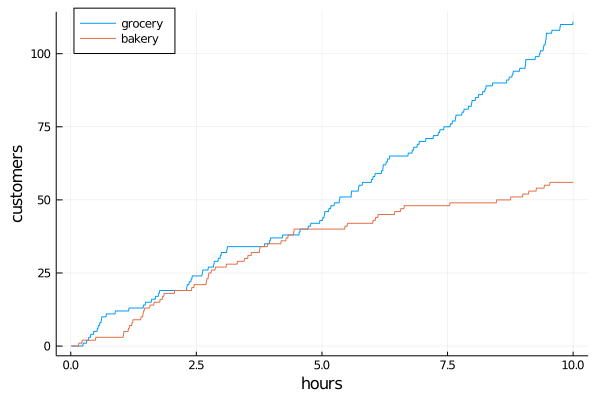

# Randomness

The elements introduced so far (clocks, events and processes) let us describe event sequences in discrete event systems (DES). In reality those sequences often show considerable randomness and come out starkly different with varying initial conditions or intervening random events.   

Random initial states, transition probabilities or stochastic event times can be computed by calling `rand(d)` on a [distribution](https://juliastats.org/Distributions.jl/stable/types/#Distributions-1) `d` from the [`Distributions`](https://juliastats.org/Distributions.jl/stable/) package.

### Two poisson processes

In the following example we simulate two arrival processes, one homogeneous poisson process (HPP) say for a grocery store and one non-homogeneous poisson process (NHPP) where the number of arrivals diminish over time e.g. for a bakery.

```julia
using DiscreteEvents, Random, Distributions, Plots

Random.seed!(1234)    # set random number seed for reproducibility
const λ = 10          # arrival rate 10 customers per hour
const ρ = log(0.2)/10 # decay constant for customer arrivals
D = Exponential(1/λ)  # interarrival time distribution

hpp  = [0]            # counting homogeneous poisson arrivals
nhpp = [0]            # counting non-homogeneous poisson arrivals
t = Float64[]         # tracing variables
y1 = Int[]
y2 = Int[]

δ(t) = Int(rand() ≤ exp(ρ*t))   # model time dependent decay of arrivals
trace(c) = (push!(t, c.time); push!(y1, hpp[1]); push!(y2, nhpp[1]))

# define two arrival functions
#       |   count             | schedule next arrival
arr1(c) = (hpp[1] += 1;         event!(c, fun(arr1, c), after, rand(D)))
arr2(c) = (nhpp[1]+= δ(c.time); event!(c, fun(arr2, c), after, rand(D)))

# create clock, schedule events and tracing and run
c = Clock()
event!(c, fun(arr1, c), after, rand(D))  # HPP arrivals (grocery store)
event!(c, fun(arr2, c), after, rand(D))  # NHPP (bakery)
periodic!(c, fun(trace, c))
run!(c, 10)

plot(t, y1, label="grocery", xlabel="hours", ylabel="customers", legend=:topleft)
plot!(t, y2, label="bakery")
```



`δ(t)` defines a time dependent probability of a state transition (customer arrival). The calls to `rand(D)` create stochastic time sequences ``(t_1, t_2, t_3, ...)`` of poisson processes.

[
