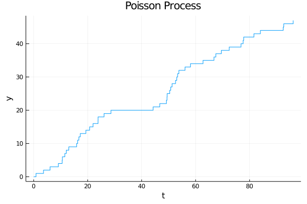

# Sampling

The simplest mechanism for generating [discrete events](events.md) is to have a [clock](clocks.md) `clk` execute an action `𝜸` periodically. We can generate periodic events in various ways:

- sampling events with `periodic!(clk, 𝜸, Δt)` are executed at the clock sample rate `Δt`,
- conditional events with `event!(clk, 𝝃, 𝜸)` check the condition `𝜸` at the clock's sample rate `Δt` until it returns `true`. Then `𝝃` is executed.

Sampling is useful if we want to model repeated or periodic events interacting with a DES, check conditions, trace or visualize the system periodically.

Sampling introduces a time uncertainty into simulations since it triggers changes, takes measurements or checks for conditions only at a given time interval Δt.

## Stochastic Event Sequences

Independent from the clock's sample rate you can have repeating events with fixed or stochastic inter-event times:

- `event!(clk, 𝜸, every, Δt)` where `Δt` is a `Number`,
- `event!(clk, 𝜸, every, Δt)` where `Δt` is a `Distribution`.

Thus you can create stochastic processes like arrivals or failures easily:

```julia
using DiscreteEvents, Distributions, Plots
c = Clock()
λ = 0.5
a = [0]
t = Float64[0.0]; y = Float64[0.0]
incra(c) = (a[1]+=1; push!(t, tau(c)); push!(y, a[1]))
event!(c, fun(incra, c), every, Exponential(1/λ))
run!(c, 100)
plot(t, y, linetype=:steppost, xlabel="t", ylabel="y", title="Poisson Process", legend=false)
```



-----

see also: [`periodic!`](https://pbayer.github.io/DiscreteEvents.jl/dev/events/#Continuous-sampling), [`event!`](https://pbayer.github.io/DiscreteEvents.jl/dev/events/#Timed-events)